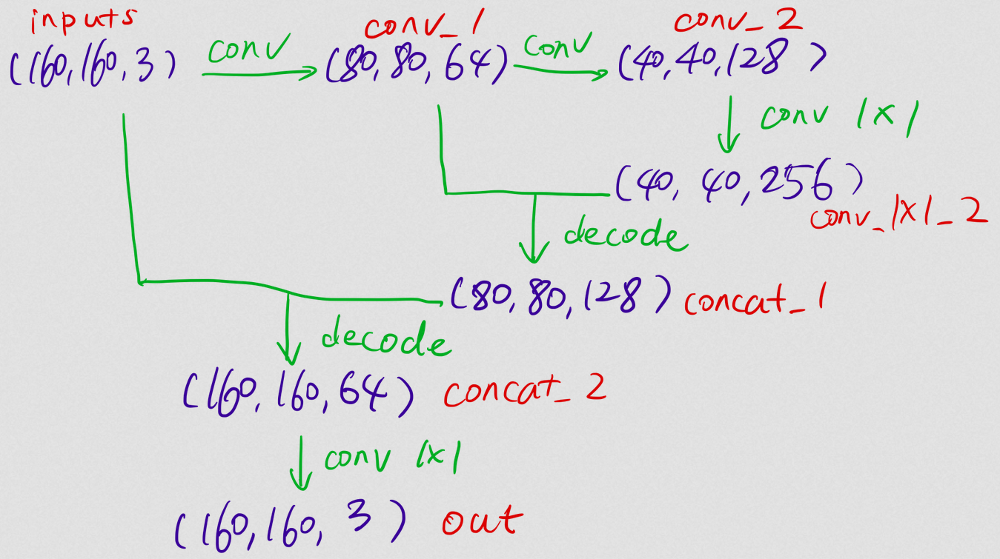
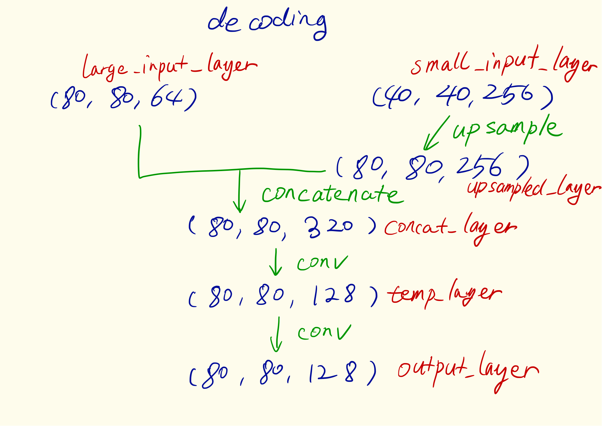
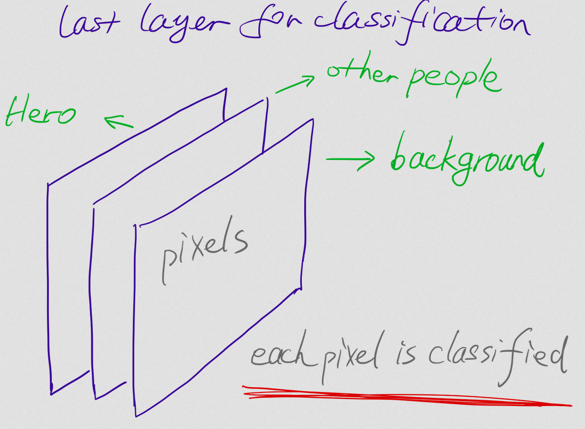

## Neural Network Architecture

The following draft shows the an overview architecture of the fully connected neural network, where the shapes of each essential layer are shown in blue color.

## Hyperparameters

* `learning_rate` is the parameter regarding the length of each learning step. When this is too large, the training process is hardly to converge. When this is too small, the training process converges too slowly. For this project the `learning_rate` is set to 0.001.

* `batch_size` is the number of the training images for one batch. When this parameter is too large. The learning process will be too general, which means that the neural network will hardly learn the details of the images. When this is too small, the learning process will be too slow, and the generalization is not good any more. For this project, `batch_size` is set to 64.

* `num_epochs` is the number of total trainings of the whole training images. This parameter should be large enough, in order to let the training converges enough. But when it is too large, the training may be overfitted, but not definitely (when the amount of training data are large enough).

* `steps_per_epoch` and `validation_steps` are for the Keras framework.

* `workers` are the maximal number of processes parallelly calculating.

## 1x1 convolution

As the draft above shows that there are several 1x1 convolutions used in the architecture. This convolution sees each pixel itself and not its surrounding pixels, which is useful to change the depth of each layer, especially for interpretation of the previous layer.

## Encoding and Decoding

* Encoding in this project is simply a normal 2d convolutional transformation, which reduces the width and height of the previous layer, but changes the depth of the previous layer.
This process sees an area of the previous layer and saves the newly obtained information into the next layer.

* For the decoding layer, the following draft shows the processes.

Decoding in this project is to concatenate two different layers and to get the stored information out of an encoded layer.

## Other Scenarios

For the last layer, the number of depth is the number of the classifications. In each depth, there are the entire pixels of an image (in one channel), and each pixel is classified into one object.

If we want to use such neural networks for other projects. We should change the number of depths of the last layer for other classifications