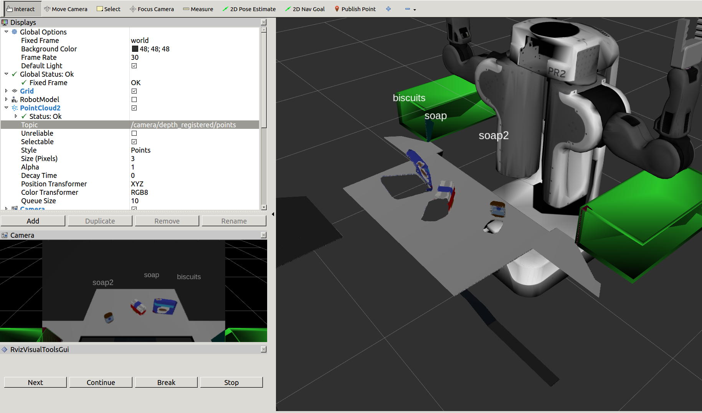
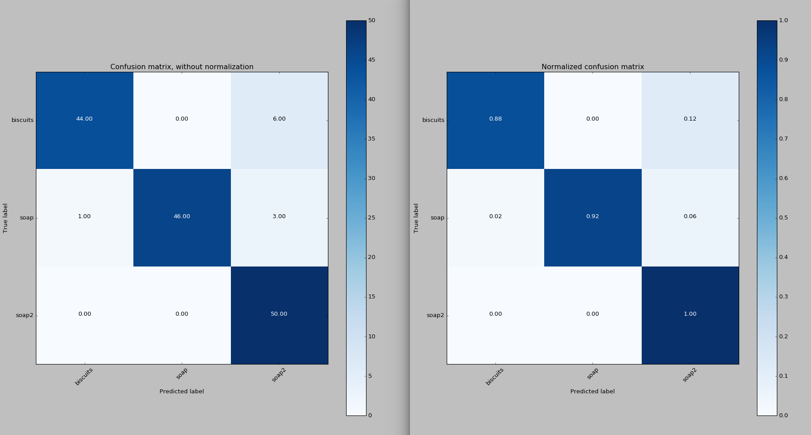
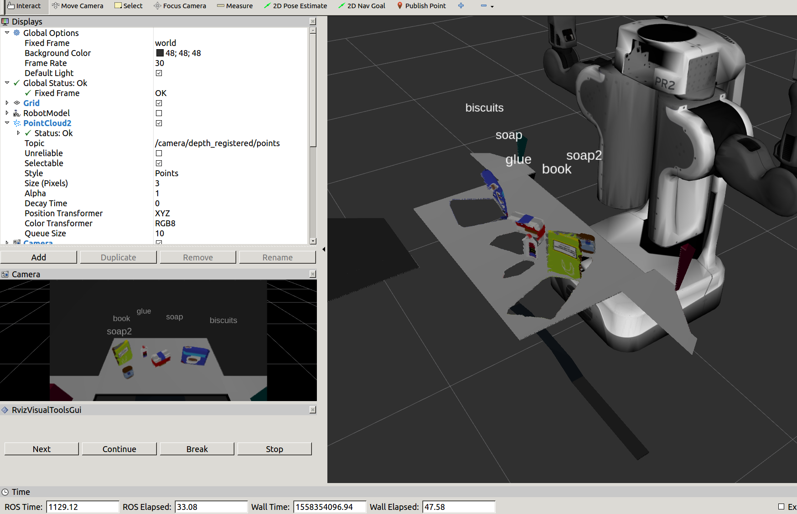
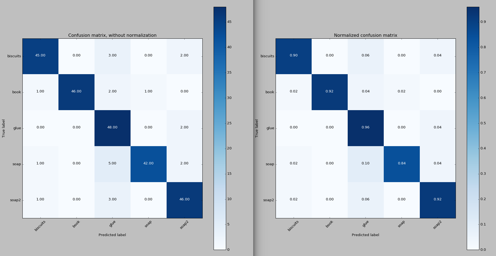
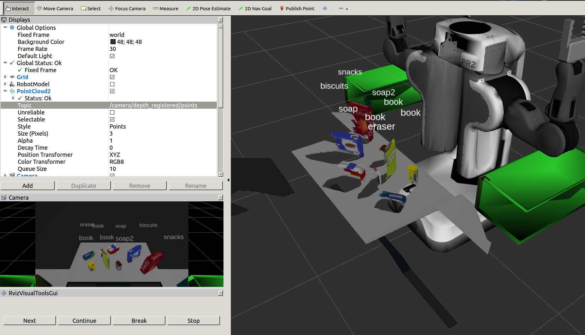
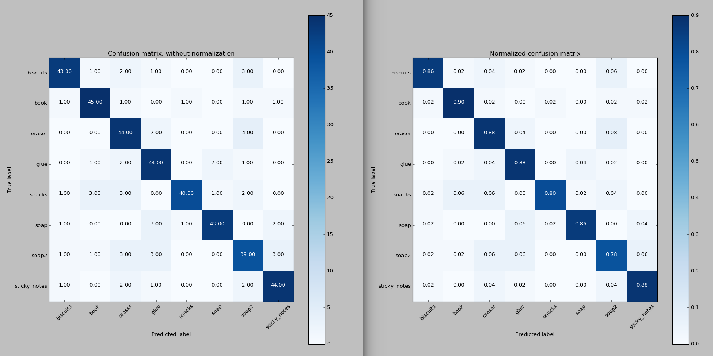

## Project: Perception Pick & Place
### Writeup Template: You can use this file as a template for your writeup if you want to submit it as a markdown file, but feel free to use some other method and submit a pdf if you prefer.

---


# Required Steps for a Passing Submission:
1. Extract features and train an SVM model on new objects (see `pick_list_*.yaml` in `/pr2_robot/config/` for the list of models you'll be trying to identify). 
2. Write a ROS node and subscribe to `/pr2/world/points` topic. This topic contains noisy point cloud data that you must work with.
3. Use filtering and RANSAC plane fitting to isolate the objects of interest from the rest of the scene.
4. Apply Euclidean clustering to create separate clusters for individual items.
5. Perform object recognition on these objects and assign them labels (markers in RViz).
6. Calculate the centroid (average in x, y and z) of the set of points belonging to that each object.
7. Create ROS messages containing the details of each object (name, pick_pose, etc.) and write these messages out to `.yaml` files, one for each of the 3 scenarios (`test1-3.world` in `/pr2_robot/worlds/`).  [See the example `output.yaml` for details on what the output should look like.](https://github.com/udacity/RoboND-Perception-Project/blob/master/pr2_robot/config/output.yaml)  
8. Submit a link to your GitHub repo for the project or the Python code for your perception pipeline and your output `.yaml` files (3 `.yaml` files, one for each test world).  You must have correctly identified 100% of objects from `pick_list_1.yaml` for `test1.world`, 80% of items from `pick_list_2.yaml` for `test2.world` and 75% of items from `pick_list_3.yaml` in `test3.world`.
9. Congratulations!  Your Done!

# Extra Challenges: Complete the Pick & Place
7. To create a collision map, publish a point cloud to the `/pr2/3d_map/points` topic and make sure you change the `point_cloud_topic` to `/pr2/3d_map/points` in `sensors.yaml` in the `/pr2_robot/config/` directory. This topic is read by Moveit!, which uses this point cloud input to generate a collision map, allowing the robot to plan its trajectory.  Keep in mind that later when you go to pick up an object, you must first remove it from this point cloud so it is removed from the collision map!
8. Rotate the robot to generate collision map of table sides. This can be accomplished by publishing joint angle value(in radians) to `/pr2/world_joint_controller/command`
9. Rotate the robot back to its original state.
10. Create a ROS Client for the “pick_place_routine” rosservice.  In the required steps above, you already created the messages you need to use this service. Checkout the [PickPlace.srv](https://github.com/udacity/RoboND-Perception-Project/tree/master/pr2_robot/srv) file to find out what arguments you must pass to this service.
11. If everything was done correctly, when you pass the appropriate messages to the `pick_place_routine` service, the selected arm will perform pick and place operation and display trajectory in the RViz window
12. Place all the objects from your pick list in their respective dropoff box and you have completed the challenge!
13. Looking for a bigger challenge?  Load up the `challenge.world` scenario and see if you can get your perception pipeline working there!

## [Rubric](https://review.udacity.com/#!/rubrics/1067/view) Points
### Here I will consider the rubric points individually and describe how I addressed each point in my implementation.  

---
### Writeup / README

#### 1. Provide a Writeup / README that includes all the rubric points and how you addressed each one.  You can submit your writeup as markdown or pdf.  

You're reading it!

### Exercise 1, 2 and 3 pipeline implemented
#### 1. Complete Exercise 1 steps. Pipeline for filtering and RANSAC plane fitting implemented.

The pipeline implemented is in the Python file `project_template.py`. The steps are written below.

1. Convert ROS msg to PCL data 
```python
    cloud = ros_to_pcl(pcl_msg)
```

2. Voxel Grid Downsampling 
```python
    vox = cloud.make_voxel_grid_filter()
```

3. Choose a voxel (also known as leaf) size 
```python
    LEAF_SIZE = 0.01
```

4. Set the voxel (or leaf) size 
```python
    vox.set_leaf_size(LEAF_SIZE, LEAF_SIZE, LEAF_SIZE)
```

5. Call the filter function to obtain the resultant downsampled point cloud 
```python
    cloud_filtered = vox.filter()
```

6. Create a PassThrough filter object. 
```python
    passthrough = cloud_filtered.make_passthrough_filter()
```

7. Assign axis and range to the passthrough filter object.
```python
    filter_axis = 'z'
    passthrough.set_filter_field_name(filter_axis)
    axis_min = 0.5
    axis_max = 0.8
    passthrough.set_filter_limits(axis_min, axis_max)
```

and

```python
    filter_axis = 'x'
    passthrough.set_filter_field_name(filter_axis)
    axis_min = 0.4
    axis_max = 2
    passthrough.set_filter_limits(axis_min, axis_max)
```
8. Finally use the filter function to obtain the resultant point cloud. 

```python
    cloud_filtered = passthrough.filter()
```

9. Extract outliers to denoise: Much like the previous filters, we start by creating a filter object: 
```python
    outlier_filter = cloud_filtered.make_statistical_outlier_filter()
```

10. Set the number of neighboring points to analyze for any given point
```python
    outlier_filter.set_mean_k(4)
```
11. Set threshold scale factor
```python
    x = 0.05
```

12. Any point with a mean distance larger than global (mean distance+x*std_dev) will be considered outlier
```python
    outlier_filter.set_std_dev_mul_thresh(x)
```
13. Finally call the filter function for magic
```python
    cloud_filtered = outlier_filter.filter()
```
#### 2. Complete Exercise 2 steps: Pipeline including clustering for segmentation implemented.  

The pipeline implemented is in the Python file `project_template.py`. The steps are described below.

1. Create the segmentation object
```python
    seg = cloud_filtered.make_segmenter()
```

2. Set the model to fit 
```python
    seg.set_model_type(pcl.SACMODEL_PLANE)
    seg.set_method_type(pcl.SAC_RANSAC)
```

3. Max distance for a point to be considered fitting the model
```python
    max_distance = 0.01
    seg.set_distance_threshold(max_distance)
```

4. Call the segment function to obtain set of inlier indices and model coefficients
```python
    inliers, coefficients = seg.segment()
```

5. Extract inliers and outliers
```python
    cloud_table = cloud_filtered.extract(inliers, negative=False)
    cloud_objects = cloud_filtered.extract(inliers, negative=True)
```

6. Euclidean Clustering
```python
    white_cloud = XYZRGB_to_XYZ(cloud_objects)
    tree = white_cloud.make_kdtree()
```

7. Create a cluster extraction object
```python
    ec = white_cloud.make_EuclideanClusterExtraction()
```

8. Set tolerances for distance threshold as well as minimum and maximum cluster size (in points)
```python
    ec.set_ClusterTolerance(0.05)
    ec.set_MinClusterSize(50)
    ec.set_MaxClusterSize(200000)
```

9. Search the k-d tree for clusters
```python
    ec.set_SearchMethod(tree)
```

10. Extract indices for each of the discovered clusters
```python
    cluster_indices = ec.Extract()
```

11. Create Cluster-Mask Point Cloud to visualize each cluster separately
```python
    cluster_color = get_color_list(len(cluster_indices))

    color_cluster_point_list = []

    for j, indices in enumerate(cluster_indices):
        for i, indice in enumerate(indices):
            color_cluster_point_list.append([white_cloud[indice][0], white_cloud[indice][1], white_cloud[indice][2], rgb_to_float(cluster_color[j])])
```

12. Create new cloud containing all clusters, each with unique color
```python
    cluster_cloud = pcl.PointCloud_PointXYZRGB()
    cluster_cloud.from_list(color_cluster_point_list)
```

13. Convert PCL data to ROS messages
```python
    ros_cloud_tabel = pcl_to_ros(cloud_table)
    ros_cloud_objects = pcl_to_ros(cloud_objects)
    ros_cluster_cloud = pcl_to_ros(cluster_cloud)
```

14. Publish ROS messages
```python
    pcl_objects_pub.publish(ros_cloud_objects)
    pcl_table_pub.publish(ros_cloud_tabel)
    pcl_cluster_pub.publish(ros_cluster_cloud)
```

#### 2. Complete Exercise 3 Steps.  Features extracted and SVM trained.  Object recognition implemented.

The pipeline implemented is in the Python file `train_svm.py`, `features.py` and `project_template.py`.

1. Classify the clusters! (loop through each detected cluster one at a time)
```python
    detected_objects_labels = []
    detected_objects = []

    for index, pts_list in enumerate(cluster_indices):
```

2. Grab the points for the cluster from the extracted outliers (cloud_objects)
```python
    pcl_cluster = cloud_objects.extract(pts_list)
```

3. convert the cluster from pcl to ROS using helper function
```python
    ros_cluster = pcl_to_ros(pcl_cluster)
```

4. Extract histogram features
```python
    chists = compute_color_histograms(ros_cluster, using_hsv=False)
    normals = get_normals(ros_cluster)
    nhists = compute_normal_histograms(normals)
    feature = np.concatenate((chists, nhists))
```

5. Make the prediction, retrieve the label for the result and add it to detected_objects_labels list
```python
    prediction = clf.predict(scaler.transform(feature.reshape(1,-1)))
    label = encoder.inverse_transform(prediction)[0]
    detected_objects_labels.append(label)
```

6. Publish a label into RViz
```python
    label_pos = list(white_cloud[pts_list[0]])
    label_pos[2] += .4
    object_markers_pub.publish(make_label(label,label_pos, index))
```

7. Add the detected object to the list of detected objects.
```python
    do = DetectedObject()
    do.label = label
    do.cloud = ros_cluster
    detected_objects.append(do)
```

8. Publish the list of detected objects
```python
    detected_objects_pub.publish(detected_objects)
```

### Pick and Place Setup

#### 1. For all three tabletop setups (`test*.world`), perform object recognition, then read in respective pick list (`pick_list_*.yaml`). Next construct the messages that would comprise a valid `PickPlace` request output them to `.yaml` format.

The results are shown in following pictures:














