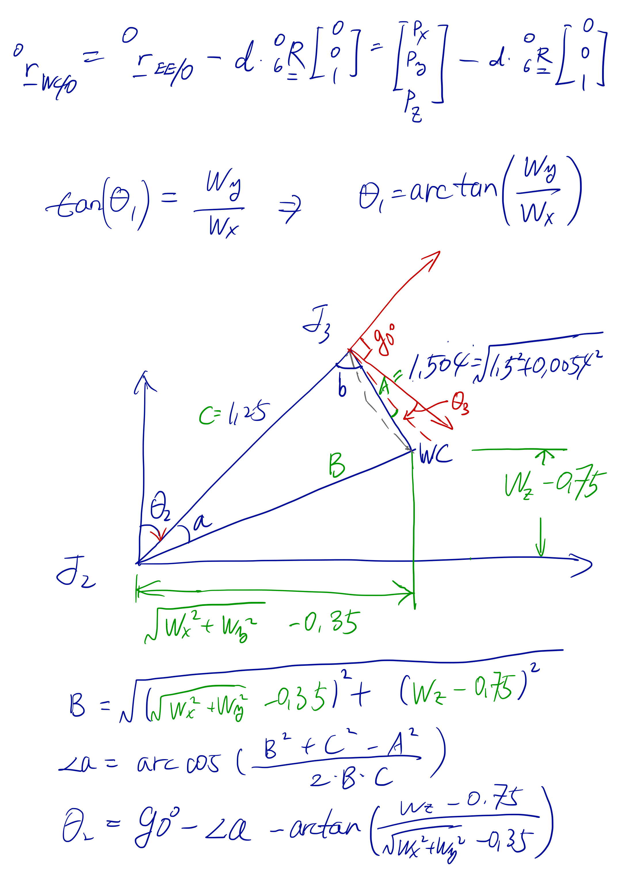
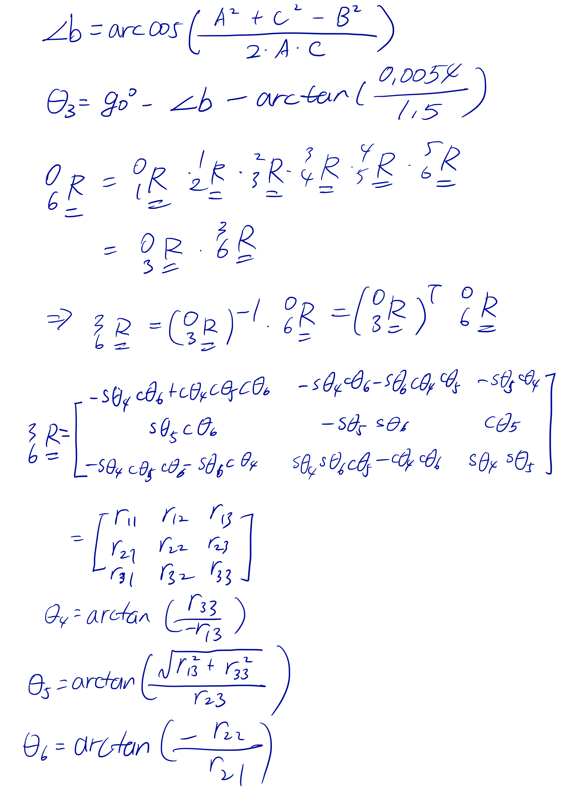
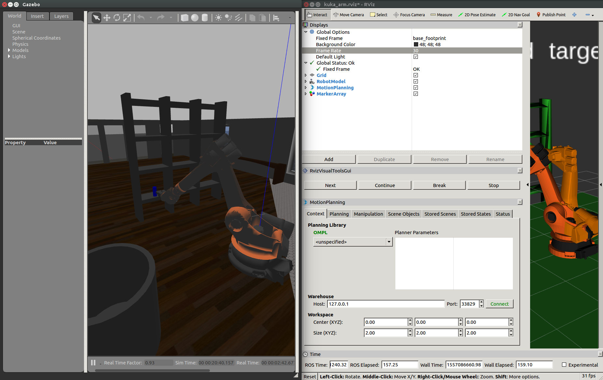

## Project: Kinematics Pick & Place
### Writeup Template: You can use this file as a template for your writeup if you want to submit it as a markdown file, but feel free to use some other method and submit a pdf if you prefer.

---


**Steps to complete the project:**  


1. Set up your ROS Workspace.
2. Download or clone the [project repository](https://github.com/udacity/RoboND-Kinematics-Project) into the ***src*** directory of your ROS Workspace.  
3. Experiment with the forward_kinematics environment and get familiar with the robot.
4. Launch in [demo mode](https://classroom.udacity.com/nanodegrees/nd209/parts/7b2fd2d7-e181-401e-977a-6158c77bf816/modules/8855de3f-2897-46c3-a805-628b5ecf045b/lessons/91d017b1-4493-4522-ad52-04a74a01094c/concepts/ae64bb91-e8c4-44c9-adbe-798e8f688193).
5. Perform Kinematic Analysis for the robot following the [project rubric](https://review.udacity.com/#!/rubrics/972/view).
6. Fill in the `IK_server.py` with your Inverse Kinematics code. 

## [Rubric](https://review.udacity.com/#!/rubrics/972/view) Points
### Here I will consider the rubric points individually and describe how I addressed each point in my implementation.  

---

### Writeup / README

#### 1. Provide a Writeup / README that includes all the rubric points and how you addressed each one.  You can submit your writeup as markdown or pdf.

You're reading it!

### Kinematic Analysis
#### 1. Run the forward_kinematics demo and evaluate the kr210.urdf.xacro file to perform kinematic analysis of Kuka KR210 robot and derive its DH parameters.


According to the URDF file, we can extract the position and orientation of each joint. With these informations we can create a DH table as follows:

Links  | i | alpha(i-1) | a(i-1) | d(i-1) | theta(i)
---    | ---  | ---   | --- | --- | ---
0->1 | 1 | 0 | 0 | 0.75 | q1
1->2 | 2 | -PI/2 | 0.35 | 0 | -PI/2 + q2
2->3 | 3 | 0 | 1.25 | 0 | q3
3->4 | 4 |  -PI/2 | -0.054 | 1.5 | q4
4->5 | 5 | PI/2 | 0 | 0 | q5
5->6 | 6 | -PI/2 | 0 | 0 | q6
6->E | 7 | 0 | 0 | 0.303 | 0

The Python implementation of the DH table is as follows:

```python
DH_table = {
    alpha0: 0, 	        a0: 0, 		d1: 0.75, 	q1: q1,
    alpha1: -pi / 2.,   a1: 0.35,	d2: 0, 		q2: -pi / 2. + q2,
    alpha2: 0, 	        a2: 1.25, 	d3: 0, 		q3: q3,
    alpha3: -pi/2.,     a3: -0.054, d4: 1.5, 	q4: q4,
    alpha4: pi/2, 	    a4: 0, 		d5: 0, 		q5: q5,
    alpha5: -pi/2.,     a5: 0, 		d6: 0, 		q6: q6,
    alpha6: 0, 	        a6: 0, 		d7: 0.303, 	q7: 0
    }
```

#### 2. Using the DH parameter table you derived earlier, create individual transformation matrices about each joint. In addition, also generate a generalized homogeneous transform between base_link and gripper_link using only end-effector(gripper) pose.

I wrote a function to calculate the transformation matrix.

```python
def get_transformation_matrix(alpha, a, d, q):
    TFMat = Matrix([
        [cos(q), 		        -sin(q), 		        0.0, 		    a               ],
        [sin(q) * cos(alpha), 	cos(q) * cos(alpha), 	-sin(alpha), 	-sin(alpha) * d ],
        [sin(q) * sin(alpha), 	cos(q) * sin(alpha), 	cos(alpha), 	cos(alpha) * d  ],
        [0.0,			        0.0,			        0.0,		    1.0             ]
        ])
    return TFMat
```

Then I can calculate the transformation matrix in python as follows:

```python
TFMat_0t1 = get_transformation_matrix(alpha0, a0, d1, q1).subs(DH_table)
TFMat_1t2 = get_transformation_matrix(alpha1, a1, d2, q2).subs(DH_table)
TFMat_2t3 = get_transformation_matrix(alpha2, a2, d3, q3).subs(DH_table)
TFMat_3t4 = get_transformation_matrix(alpha3, a3, d4, q4).subs(DH_table)
TFMat_4t5 = get_transformation_matrix(alpha4, a4, d5, q5).subs(DH_table)
TFMat_5t6 = get_transformation_matrix(alpha5, a5, d6, q6).subs(DH_table)
TFMat_6tE = get_transformation_matrix(alpha6, a6, d7, q7).subs(DH_table)
```

The transformation Matrix from the base to the end effector is as follows:

```python
TFMat_0tE = simplify(TFMat_0t1 * TFMat_1t2 * TFMat_2t3 * TFMat_3t4 * TFMat_4t5 * TFMat_5t6 * TFMat_6tE)
```

The results of matrixes are as follows:

```
TFMat_0t1 =    
    [[cos(q1), -sin(q1), 0, 0    ], 
     [sin(q1), cos(q1),  0, 0    ], 
     [0,       0,        1, 0.75 ], 
     [0,       0,        0, 1    ]]
```

```
TFMat_1t2 =    
    [[cos(q2 - 0.5*pi),     -sin(q2 - 0.5*pi),  0, 0.35 ], 
     [0,                    0,                  1, 0    ], 
     [-sin(q2 - 0.5*pi),    -cos(q2 - 0.5*pi),  0, 0    ], 
     [0,                    0,                  0, 1    ]]
```

```
TFMat_2t3 =
    [[cos(q3),  -sin(q3),   0, 1.25 ], 
     [sin(q3),  cos(q3),    0, 0    ], 
     [0,        0,          1, 0    ], 
     [0,        0,          0, 1    ]]
```

```
TFMat_3t4 =    
    [[cos(q4),  -sin(q4),   0, -0.054   ], 
     [0,        0,          1, 1.5      ], 
     [-sin(q4), -cos(q4),   0, 0        ], 
     [0,        0,          0, 1        ]]
```

```
TFMat_4t5 =    
    [[cos(q5),  -sin(q5),   0,  0], 
     [0,        0,          -1, 0], 
     [sin(q5),  cos(q5),    0,  0], 
     [0,        0,          0,  1]]
```

```
TFMat_5t6 =    
    [[cos(q6),  -sin(q6),   0, 0], 
     [0,        0,          1, 0], 
     [-sin(q6), -cos(q6),   0, 0], 
     [0,        0,          0, 1]]
```

```
TFMat_6tE =    
    [[1, 0, 0, 0    ], 
     [0, 1, 0, 0    ], 
     [0, 0, 1, 0.303], 
     [0, 0, 0, 1    ]]
```

When all `q_n = 0`

```
TFMat_0tE =
    [[0, 0,     1, 2.153], 
     [0, -1,    0, 0    ], 
     [1, 0,     0, 1.946], 
     [0, 0,     0, 1    ]]
```

#### 3. Decouple Inverse Kinematics problem into Inverse Position Kinematics and inverse Orientation Kinematics; doing so derive the equations to calculate all individual joint angles.

The following is the derivation of the Inverse Kinematics.





```
theta_1 = arctan(y_c, x_c)
A = 1.501
C = 1.25
b = (((y_c^2 + x_c^2)^0.5 - 0.35)^2 + (z_c - 0.75)^2)^0.5

angle_a = arccos(( - a^2 + b^2 + c^2 )/2bc)
angle_b = arccos(( + a^2 - b^2 + c^2 )/2ac)
angle_c = arccos(( + a^2 + b^2 - c^2 )/2ab)

theta_2 = PI/2 - angle_a - arctan(z_c - 0.75, (x_c^2 + y_c^2)^0.5 - 0.35)
theta_3 = PI/2 - angle_b - 0.036
```

Then we can get the rotation matrix as follows:

```
R0_3 = R0_1 * R1_2 * R2_3
R3_6 = R0_3^-1 * R0_6
```

Then I calculated the Euler angles from the rotation matrix (3t6).

```python
theta4 = atan2(rotation_3t6[2, 2], -rotation_3t6[0, 2])
theta5 = atan2(sqrt(rotation_3t6[0, 2] ** 2 + rotation_3t6[2, 2] ** 2), rotation_3t6[1, 2])
theta6 = atan2(-rotation_3t6[1, 1], rotation_3t6[1, 0])
```

### Project Implementation

#### 1. Fill in the `IK_server.py` file with properly commented python code for calculating Inverse Kinematics based on previously performed Kinematic Analysis. Your code must guide the robot to successfully complete 8/10 pick and place cycles. Briefly discuss the code you implemented and your results. 

The code ran successfully multiple times. A youtube video is as follows:


[](https://www.youtube.com/watch?v=JGloab-MAHc&feature=youtu.be)


